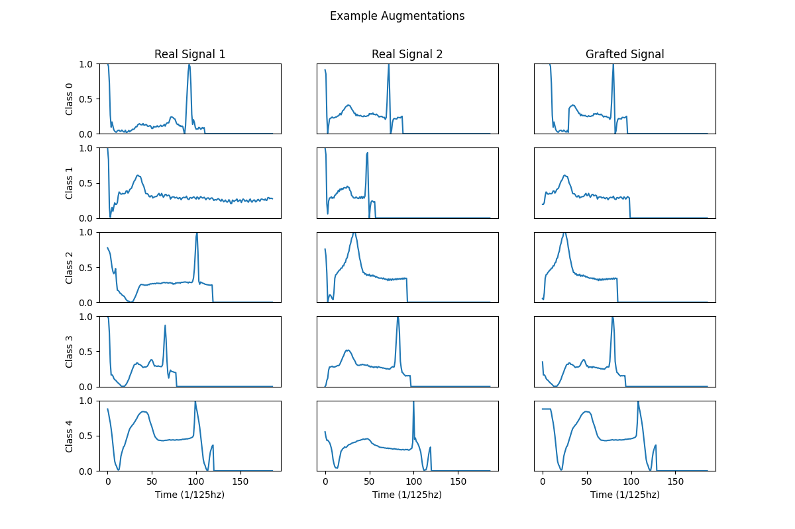

ECG Arrythmia Classification
==============================
Description: Classifying heartbeat Arrythmia from ECG Signals

Author: Andre Telfer

## Task 1: Data Processing 

### Exploratory Data Analysis 

In the [exploratory data analysis notebook](https://github.com/A-Telfer/telfer-ecg-heartbeat-categorization-task/blob/master/notebooks/1.0-telfer-exploratory-data-analysis.ipynb) we identified the composition of the dataset in terms of data size, types, and range. We found that the target classes were very imbalanced (Table 1). By describing the data we found that the signals were normalized between [0, 1] and were followed by trailing zeros to pad shorter signals. 

<html>
<table border="1" class="dataframe">
  <thead>
    <tr style="text-align: right;">
      <th>Class Label</th>
      <th>Samples</th>
      <th>Ratio</th>
    </tr>
  </thead>
  <tbody>
    <tr>
      <th>0</th>
      <td>72471</td>
      <td>0.828</td>
    </tr>
    <tr>
      <th>1</th>
      <td>2223</td>
      <td>0.025</td>
    </tr>
    <tr>
      <th>2</th>
      <td>5788</td>
      <td>0.066</td>
    </tr>
    <tr>
      <th>3</th>
      <td>641</td>
      <td>0.007</td>
    </tr>
    <tr>
      <th>4</th>
      <td>6431</td>
      <td>0.073</td>
    </tr>
  </tbody>
</table>

*Table 1: Sample class distribution in the training dataset.*
</html>

We visualized sample signals from each class, noting several aspects that signals differed such as peak locations, mean amplitude, and signal length. 


*Figure 1: Sample Features from each class. For example, Class 3 and Class 4 shows indications of differences in peak location and signal length.*


### Data Augmentation
Code: https://github.com/A-Telfer/telfer-ecg-heartbeat-categorization-task/blob/master/src/data/make_dataset.py

We applied two augmentation techniques to the training dataset:

- **Signal Grafting**: two signals from the same class were sampled and merged together [CODE]. The goal of this method was to preserve properties of each class while generating new hybrid examples which were typically realistic [EXAMPLE]. 
    ```python
    def graft_signals(signal1, signal2):
        """Combines two signals at a random point to generate a new signal"""
        split_point = random.randint(0, len(signal1) - 1)
        return np.concatenate([signal1[:split_point], signal2[split_point:]])
    ```
- **Temporal Shift**: signals were shifted $t \in[-5,5]$ along the time axis. The goal of this augmentation was to prevent overfitting of training examples by specific neural-circuits in the model, and also help learn temporal relationships between input neurons (we used a basic linear model, and not a convolutional model that would better preserve these relationships). Any leading or trailing nan values this introduced were filled with the next or last non-nan value respectively. 
    ````python
    def temporal_shift_signal(signal, max_shift=10):
        """Applies a random shift along the x-axis"""
        s = pd.Series(signal)
        d = random.randint(-max_shift, max_shift)
        s = s.shift(d).ffill().bfill()
        return s.values
    ````

Adding small signal is another popular method for data augmentation, however after observing the signals in Figure 1 we decided adding high frequency noise could obscure potential useful features. For example, samples from Class 1 appeared to have more high frequency noise than Class 3, so adding more noise could mask these differences. 

To mitigate the class imbalances during training, we generated a fixed number of new signals per class using the Signal Grafting method described above (followed by a Temporal Shift). To perform hyper-parameter analysis we generated smaller set of 10,000 examples per class (upsampling some classes, downsampling others) which allowed for quicker training.



*Figure 2: Demonstration of grafting and temporal shift. Not all generated signals will be different from the originals if the split occurs after the signals end (e.g. during the trailing zeros).*

### Feature Engineering
Code: https://github.com/A-Telfer/telfer-ecg-heartbeat-categorization-task/blob/master/src/features/build_features.py

Rather than hand-crafted features, we opted for a wavelet transform (Mexican Hat Wavelet using the pywt package) to encode joint temporal and frequency domain features. While wavelet transforms are often used in ECG signals that haven't been processed to separate heartbeats, we can still observe some wave-like features in the signal examples. 


*Figure 3: Example wavelet features extracted from a signal.*

Joint time-frequency domain features are advantantageous as they can capture frequency and temporal information (e.g. Figure 3). One downside of using joint time-frequency domain features is that they are not intuitive and therefore not very suitable when explainability is important. Another concern is that the can greatly expand the feature space. Simpler hand-crafted features may be preferable in some contexts for explainability and speed. 

A simpler approach may have been to allow the classification model to learn it's own features directly from the signal. For a longer project, contrastive learning may have been a promising approach to generate features that emphasize differences between classes.


### Missing Data
The original dataset did not contain any NaN values. The original dataset however appears to have filled missing values with 0 (e.g. trailing zeros after the signal). Because the signal appears normalized between \[0,1\]. Due to this normalization, imputing using zeros indicates that the missing values are equivalent to the lowest point of the signal.

Missing data was introduced by our temporal shift augmentation. Because these values occured at the beginning and end of each signal, we opted to fill them using the next or previous value respectively. 

Strategies we may have used in other situations:
- If missing data occured in the middle of the signal, we could have linearly interpolated it. 
- If the dataset was very sparse, we may have created a new dummy field to indicate missing values in the original dataset and then filled the missing values with some placeholder. Or we could have included the time of each present values as a separate feature.

The main risk of imputing values is that they can distort the dataset and obscure the real data. For example, with time series data, imputing missing values using global averages will obscure temporal features such as trends. 

## Model Training and Fine Tuning

### Model 
Code: https://github.com/A-Telfer/telfer-ecg-heartbeat-categorization-task/blob/master/src/models/train_model.py

We implemented a simple Model using stacked linear layers (size=2048) in Pytorch and Lightning. Despite it's simplicity, from previous experience I know Linear models have worked well with real-world EEG datasets which similar properties. Linear models are also often faster than convolution models (can depend on parameters such as stride), though they are much larger. 

An alternative approach may have been to use a 1D Convolutional model. One of the main strengths of convolutional models is their ability to extract spatial and frequency information, however we have already moved towards this by using wavelet features. Convolutional models are often slower and can be harder to restructure when changing the feature space.

Another approach may have been to use an LSTM or other recurrent model, however these are considerably slower to train/infer with and can struggle with longer signals (similarly attention/transformer networks can struggle with longer signals).

```python
class LinearModel(pl.LightningModule):
    def __init__(
        self,
        learning_rate=1e-3,
        momentum=0.9,
        weight_decay=1e-3,
        input_size=187,
        output_size=5,
        num_hidden_layers=1,
        hidden_layer_size=2048,
    ):
        super().__init__()
        self.learning_rate = learning_rate
        self.momentum = momentum
        self.weight_decay = weight_decay

        hidden_layers = []
        for _ in range(num_hidden_layers):
            hidden_layers.append(
                torch.nn.Linear(hidden_layer_size, hidden_layer_size))
            hidden_layers.append(torch.nn.LeakyReLU())
            torch.nn.Dropout(),

        self._model = torch.nn.Sequential(
            torch.nn.Linear(input_size, hidden_layer_size),
            torch.nn.LeakyReLU(),
            *hidden_layers,
            torch.nn.LeakyReLU(),
            torch.nn.Linear(hidden_layer_size, output_size),
        )

        ...
```

### Hyper Parameter Optimization
Code: https://github.com/A-Telfer/telfer-ecg-heartbeat-categorization-task/blob/master/src/models/hparam_opt.py

We performed hyper-parameter optimization on the following parameters simultaneously using `optuna` and `mlflow`: 

- Learning Rate: 
  - Range: \[1e-1, 1e-5\]
  - Sampling: Log uniform
- Momentum: 
  - Values: \[0, 0.99\]
  - Sampling: Uniform
- Weight Decay
  - Values: \[0, 1e-2\]
  - Sampling: Log uniform
- Model Hidden Layers:
  - Values: \{1,2,3,4\}
  - Sampling: Categorical 

Optimization was performed using Tree of Parzen Estimators (TPE) implemented in the `optuna` package. For demonstrative purposes, we only performed 20 runs. Each run consisted of up to 100 training epochs (shorter depending on the early-stopping callback). 

The training dataset was balanced during the augmentation stage, so we optimized using a standard unweighted crossentropy loss. The validation, test, and holdout datasets were not balanced however. Therefore to evaluate models we used the AUROC (with a macro average such that class was given equal weighting). 

The optimal parameters that were found after 20 runs were: `learning_rate=0.0053`, `num_layers=4`, `momentum=0.969`, `weight_decay=0.0001`

Given that we were optimizing several values at once, 20 runs is unlikely to be enough. An improvement could have been to optimize one parameter at a time, which pytorch has previously used for achieving state-of-the-art performance on imagenet: https://pytorch.org/blog/how-to-train-state-of-the-art-models-using-torchvision-latest-primitives/) 

### Overfitting and Underfitting

To prevent overfitting we used a weight decay, dropout layers after each hidden layer, and implemented our own early stopping callback with checkpointing. 

Including the model-size (number of hidden layers) in the hyper-parameter optimization also served to help avoid overfitting/underfitting as increasing the number of parameters in the model can help to prevent underfitting, and decreasing the number of parameters can help to prevent overfitting.

### Early Stopping Callback

We implemented early stopping callback that stops the training and loads the best model. The rationale behind early stopping is simple, once the model stops improving on the validation set then the model is likely beginning to overfit to the training dataset. We add `patience` to allow for the model to exit suboptimal minimas that cause the validation metric to worsen temporarily.


*Figure 4: Evaluation runs show early stopping after validation AUC plateaus.*


```python
lass MetricsCallback(Callback):
    def __init__(self, mlflow_run, num_classes=5, early_stopping_patience=5):
        super().__init__()
        self.logger = logging.getLogger(__name__)

        # Define metrics
        ...
        self.auroc_macro = torchmetrics.AUROC(
            task="multiclass", num_classes=num_classes, average="macro"
        )

        # Early stopping
        self.stop_on_next_train_epoch_end = False
        self.early_stopping_last_value = None
        self.early_stopping_patience = early_stopping_patience
        self.early_stopping_count = early_stopping_patience
        self.early_stopping_checkpoint = f"{mlflow_run.info.run_id}_best.pt"

    ...

    def on_train_epoch_end(self, trainer, pl_module):
        ...

        # Early stopping
        if self.stop_on_next_train_epoch_end:
            trainer.should_stop = True
            pl_module._model = torch.load(self.early_stopping_checkpoint)
            os.remove(self.early_stopping_checkpoint)
            self.logger.info(
                "early stopping triggered, returning best checkpoint"
            )

    def on_validation_epoch_end(self, trainer, pl_module):
        auroc = ...

        # Early stopping
        if (
            self.early_stopping_last_value is None
            or auroc > self.early_stopping_last_value
        ):
            self.early_stopping_last_value = auroc
            self.early_stopping_count = self.early_stopping_patience

            # Save best checkpoint
            torch.save(pl_module._model, self.early_stopping_checkpoint)
        else:
            self.early_stopping_count -= 1

        if self.early_stopping_count == 0:
            self.stop_on_next_train_epoch_end = True
```

### Evaluation

Code: https://github.com/A-Telfer/telfer-ecg-heartbeat-categorization-task/blob/master/notebooks/4.0-telfer-explore-results.ipynb

We used the validation dataset for early stopping, and the testing dataset was used to select a model for hyper-parameter optimization, so evaluation was run on a separate holdout set. (Performance was higher on the testing dataset as expected and is compared in the next section)

On the holdout set, the model had an AUROC of 0.9833. It's average accuracy across classes was 0.8961, however the micro accuracy on all test cases (not accounting for class imbalance) was 0.9445 due to its high performance on the over-represented classes.


*Figure 5: Confusion Matrix results on the holdout dataset normalized over the True label. We see that the model struggles the most to classify Class 1, often confusing it for Class 0.*

There are many ways we may improve the model, here are a few examples 
- The model may be overly simplistic. Even a basic convolutional neural networks may provide better performance as they are well suited to tasks when data is spatially or temporally related.
- The learning rate can be decreased overtime, either using a learning rate callback or a learning rate scheduler. 
- The number of runs for hyper-parameter optimization was very small compared to the number of parameters being optimized. Increasing the runs, or optimizing fields individually is likely to improve results.
- The hyper-parameter optimization can be expanded to compare different features, augmentation approaches, and model types.
- I think contrastive learning (perhaps with Triplet-loss) may provide interesting features and improve performance


## Testing the Holdout Set
Code: https://github.com/A-Telfer/telfer-ecg-heartbeat-categorization-task/blob/master/notebooks/4.0-telfer-explore-results.ipynb

The results on the holdout dataset (Figure 7) were poorer than the test dataset (Figure 6). The AUC also declined from the training (0.999) -> validation (0.991) -> -> test (0.986) -> holdout (0.983). 

These results make sense because each time we train or select a model based on a dataset we are effectively fitting to it. Therefore the performance of models on these datasets is expected to be slightly higher than on new datasets (such as the holdout on which no decision have been made). 

- Training Dataset: The model is fit to the dataset directly due to training on it
- Validation Dataset: Less directly the model is fit to this dataset because it is used for early stopping and model selection. The model is frozen at the point where it performed best on the validation set.
- Testing Dataset: This dataset is used to select hyperparameters, thus hyperparameters that lead to poor performance on the test set are discarded.
- Holdout: The holdout is purely used for evaluation. No decisions are currently being made on it, leaving it as the best indicator of model performance in the real world.


*Figure 6: Confusion Matrix results on the test dataset normalized over the True label. F1=0.9864, Accuracy(macro average)=0.9062, Accuracy(micro average)=0.9450*


*Figure 7 (Duplicate of Figure 5): Confusion Matrix results on the holdout dataset normalized over the True label. F1=0.9833, Accuracy(macro average)=0.8961, Accuracy(micro average)=0.9445*

## Deployment Strategies
Models can be deployed in a number of ways, for example as a REST API web service, as a real-time streaming service, or to edge devices. 

Depending on the context, each of these may be appropriate. For example, if the goal of this is to create a heartbeat Arrythmia diagnosis application, a web server may be the most suitable as it can easily be accessed by external applications (it is also the easiest to deploy). However if this is for monitoring patients and Arrythmia poses an immediate risk, either a real-time streaming service or edge device would be more appropriate. If the model needs to be deployed along with specific hardware for measuring heartbeats, and may need to be mobile or be used in emergency situations where network connectivity is not gaurenteed, then an edge device that can function independently may be the most appropriate.

A few important considerations which can help to decide the deployment strategy are:
- Who needs to access the service (is it public, or for internal use)
- How quickly do results need to be returned (e.g. real time, of is a delay fine)
- How much bandwidth/compute is needed? (if it needs a lot, it may limit what devices it can be deployed on)

Separate from these considerations, we also need to ensure the model is working as expected. In some domains, data can drift causing the model to become less accurate over time. Also, if we are constantly improving the model and releasing new versions there is always the chance of a bad release where a model performs much worse in the real world compared to the test environment. There are a few strategies to help mitigate these issues that should incorporated into automatic pipelines:
- monitor incoming data and outgoing predictions with statistical analysis to ensure they belong to the same distributions as historical data. Any differences should be reported. This may also help prevent a wide range of issues such as faulty connections, or identify situations where the model may not be adequately trained
- when releasing models, have multiple-validation checks. For example, before moving a model to production, a final holdout set should be set aside to pass/fail the model during staging.
- infravalidation can also be used before pushing models to production in order to verify that they work as expected in the test environment. 


A possible scalable deployment environment might look like this:
1. heart beats ECG signals are collected and streamed using Apache Kafka to an Apache Spark cluster
2. a load manager directs the stream to an available server, where the data is processed
3. the data stream is then split to perform feature extraction and run validation statistics 
4. the feature-extracted stream is then used to run inference on
5. the inference results and statistics are then joined and streamed back over Kafka to subscribed users (e.g. nursing stations, other web services) and to a data sink (e.g. a SQL database).

When deploying a new model, the pipelines may look like
1. Perform hyperparameter optimization with the model (to prevent overfitting use a validation set for callbacks such as early stopping)
2. Select the hyperparameters based on a models performance on a test dataset
3. Evaluate the model on a holdout set to see if it outperforms the current production model by a sufficient amount
5. Move the model to staging and run infravalidation on the model in a production environment (evaluate with another holdout dataset) to see how the model functions in the real world
6. Deploy the model to production 

Project Organization
------------

    ├── LICENSE
    ├── MLProject          <- MLFlow project 
    ├── environment.yml    <- Conda environment to run code
    ├── Dockerfile         <- Docker environmnet to run code
    ├── Makefile           <- Makefile with commands like `make data` or `make train`
    ├── README.md          <- The top-level README for developers using this project.
    ├── data
    │   ├── processed      <- The final, canonical data sets for modeling.
    │   └── raw            <- The original, immutable data dump.
    │
    ├── docs               <- A default Sphinx project; see sphinx-doc.org for details
    │
    ├── notebooks          <- Jupyter notebooks. 
    │
    ├── reports            <- Generated analysis as HTML, PDF, LaTeX, etc.
    │   └── figures        <- Generated graphics and figures to be used in reporting
    │
    ├── requirements.txt   <- The requirements file for reproducing the analysis environment, e.g.
    │                         generated with `pip freeze > requirements.txt`
    │
    ├── setup.py           <- makes project pip installable (pip install -e .) so src can be imported
    ├── src                <- Source code for use in this project.
    │   ├── __init__.py    <- Makes src a Python module
    │   │
    │   ├── data           <- Scripts to download or generate data
    │   │   └── make_dataset.py
    │   │
    │   ├── features       <- Scripts to turn raw data into features for modeling
    │   │   └── build_features.py
    │   │
    │   ├── models         <- Scripts to train models and then use trained models to make
    │   │   │                 predictions
    │   │   └── train_model.py
    │   │   └── hparam_opt.py
    │   │
    │
    └── tox.ini            <- tox file with settings for running tox; see tox.readthedocs.io


--------

<p><small>Project based on the <a target="_blank" href="https://drivendata.github.io/cookiecutter-data-science/">cookiecutter data science project template</a>. #cookiecutterdatascience</small></p>
